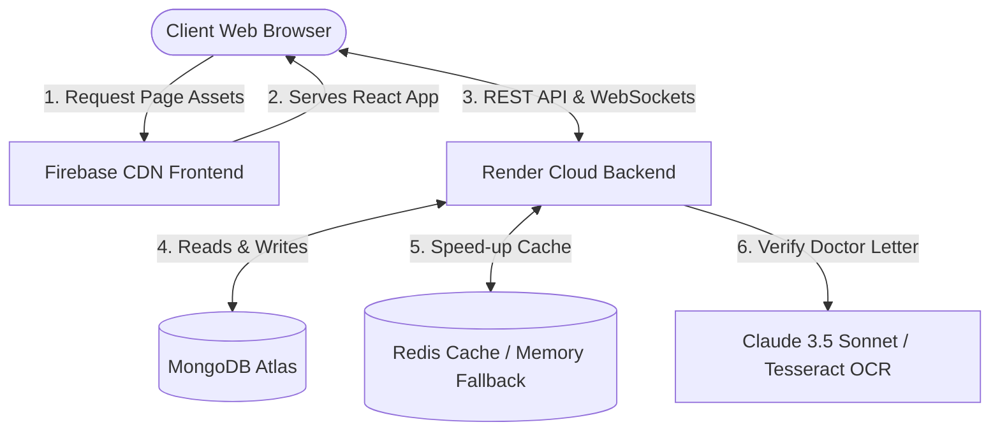
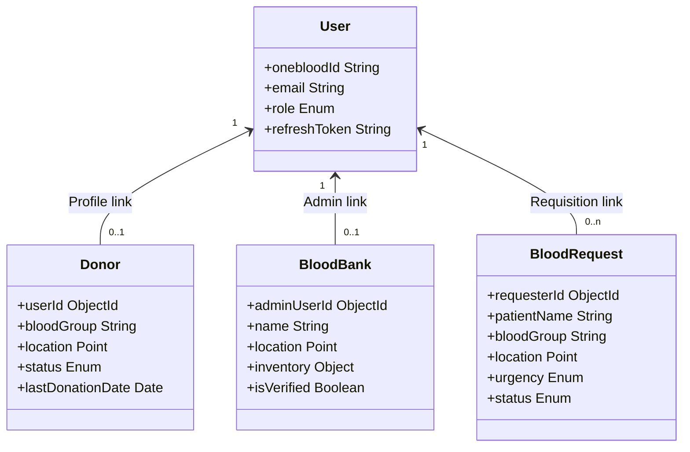

# OneBlood — Backend Protocols & System Architecture Detailed Summary

This document provides an exhaustive technical analysis of the backend protocols, communication patterns, database indexing strategies, and automated pipelines implemented in the **OneBlood** real-time emergency blood coordination platform.

---

## 🏢 1. Decoupled System Topology

The **OneBlood** platform operates as a decoupled, multi-tier system:
*   **Client (Frontend)**: React Single Page Application (SPA) compiled using Vite and deployed to global edge caches via **Firebase Hosting**. State management is driven by [Zustand](file:///c:/Users/JOEL%20BIJU/Documents/OneBlood/frontend/src/store/authStore.js) for persistent session states and React Context for notifications.
*   **API & Real-time Server (Backend)**: An Express.js application running on Node.js, hosted on **Render** (`https://oneblood-nvg1.onrender.com`). It serves REST API endpoints and binds to a `socket.io` instance to orchestrate persistent full-duplex TCP connections.
*   **Database**: **MongoDB Atlas** database cluster housing data objects for Users, Donors, Blood Banks, notice board announcements, active requests, and direct chat messages.



---

## ⚙️ 2. Core Backend Protocols

### A. HTTP & REST API Architecture
The backend application entrypoint is bootstrapped in [server.js](file:///c:/Users/JOEL%20BIJU/Documents/OneBlood/backend/src/server.js) and configured in [app.js](file:///c:/Users/JOEL%20BIJU/Documents/OneBlood/backend/src/app.js). It supports a micro-resource REST architecture with the following routing configurations:

*   `/api/auth`: Handles registration, credential verification, admin portal entry, JWT session refreshes, and role toggle actions.
*   `/api/donors`: Manages donor-specific profile registrations, active status, last donation lockers (enforcing the 56-day clinical hold), and matching histories.
*   `/api/banks`: Manages blood bank credentials, verified hospital registers, and inventory balances mapped dynamically to blood groups and component keys.
*   `/api/requests`: Governs seeker requisitions, file attachment ingestion, AI verification states, and fulfillment cycles.
*   `/api/donations`: Coordinates active match states, routing coordinates, verification badges, and official PDF slips.
*   `/api/chat`: Retouches private messaging metadata.
*   `/api/hospitals`: Controls hospital registrations.

#### 🛡️ Middlewares Configured in [app.js](file:///c:/Users/JOEL%20BIJU/Documents/OneBlood/backend/src/app.js)
1.  **CORS (Cross-Origin Resource Sharing)**:
    Since the client is hosted on Firebase (`https://oneblood-app.web.app`) and the API server runs on Render, CORS allows secure requests by validating incoming origins against a strict whitelist while supporting credentials transmission:
    ```javascript
    app.use(cors({
      origin: function (origin, callback) {
        if (!origin) return callback(null, true);
        const isLocal = /^http:\/\/(localhost|127\.0\.0\.1|192\.168\.\d+\.\d+):\d+$/.test(origin);
        if (isLocal || allowedOrigins.indexOf(origin) !== -1) {
          return callback(null, true);
        }
        return callback(new Error('Blocked by CORS policy'), false);
      },
      credentials: true,
    }));
    ```
2.  **Rate Limiter (`express-rate-limit`)**: Prevents brute force and denial of service attacks by setting IP-based request windows:
    *   *General API*: Cap of 500 requests per 15 minutes in production.
    *   *Authentication API*: Strict cap of 100 requests per 15 minutes.
3.  **Security Hardening**:
    *   `helmet()`: Sets standard HTTP headers to protect against common web vulnerabilities.
    *   `express-mongo-sanitize()`: Strips out query operators containing `$` or `.` signs from user bodies to prevent MongoDB injection.
4.  **Cookie Parser (`cookie-parser`)**: Extracts cookies for silent token verification.

---

### B. WebSocket (Socket.IO) Protocol
Real-time messaging, map coordinates, and alerts are governed by **Socket.IO** (see [socketService.js](file:///c:/Users/JOEL%20BIJU/Documents/OneBlood/backend/src/services/socketService.js)).

#### 1. Socket Authentication
Sockets are initialized with authorization headers passing the token directly. The backend validates this token before joining the client to any socket channels:
```javascript
io.use((socket, next) => {
  const token = socket.handshake.auth.token;
  if (!token) return next(new Error('Authentication required'));
  try {
    const decoded = jwt.verify(token, JWT_SECRET);
    socket.userId = decoded.id;
    next();
  } catch (err) {
    next(new Error('Invalid token'));
  }
});
```

#### 2. Socket Room Subscriptions
Upon connection, users automatically join distinct rooms:
*   `user_[userId]`: Receives real-time notifications, alert updates, and peer-to-peer chat hooks.
*   `donor_[donorId]`: Direct channel for specific donors.
*   `donor:[bloodGroup]:[city]`: Regional matching rooms (e.g. `donor:O+:hubli`) for rapid regional broadcast alerts.
*   `bloodbank:[bankId]`: Dynamically alerts blood bank administrators of low stock levels.
*   `chat_[requestId]`: An encrypted chat room between matching parties. To protect privacy, a WebSocket joins a chat room only after checking:
    1.  If `userId` matches `requesterId` on the `BloodRequest` schema.
    2.  If `userId` matches a `Donor` whose response status on the request is `'accepted'`.
    3.  If `userId` corresponds to a system administrator (`admin`).

---

### C. Database & Geospatial Proximity Protocol
MongoDB schemas are declared under `/backend/src/models/`.



*   **Geospatial Lookup**: Locating close matching donors relies on native MongoDB spherical queries. Donor locations are stored as GeoJSON `Point` fields and indexed using a `2dsphere` index inside [Donor.js](file:///c:/Users/JOEL%20BIJU/Documents/OneBlood/backend/src/models/Donor.js):
    ```javascript
    donorSchema.index({ location: '2dsphere' });
    ```
    This index is queried via Express controllers utilizing `$near` or `$nearSphere` query properties:
    ```javascript
    const nearbyDonors = await Donor.find({
      location: {
        $nearSphere: {
          $geometry: { type: "Point", coordinates: [lng, lat] },
          $maxDistance: radiusInKms * 1000 // In Meters
        }
      },
      status: 'available'
    });
    ```

---

### D. Security & Session Protocols (Dual-JWT Strategy)
Authentication operates on a dual-JWT rotation mechanism:
1.  **Access Token (JWT)**: Issued with a short expiration lifespan (1 hour). Stored solely in-memory within the React client's Zustand store to block Cross-Site Scripting (XSS) access vectors.
2.  **Refresh Token (JWT)**: Issued with a 7-day lifespan. Stored inside `localStorage` or inside secure HTTP-only cookies.
3.  **Silent Refresh Flow**: If the client receives a `401 Unauthorized` response on any API route, the Axios interceptor sends the stored refresh token to `/api/auth/refresh`. The server checks the refresh token signature, returns a new access token, and the client retries the failed API call automatically.

---

### E. Resilient Hybrid Caching Protocol (Redis Fallback)
The system leverages **Redis** to cache database queries and manage session caches. Since local/development environments might not have a running Redis daemon, [redis.js](file:///c:/Users/JOEL%20BIJU/Documents/OneBlood/backend/src/config/redis.js) exposes a hybrid wrapper:
*   Attempts connection to `process.env.REDIS_URL`.
*   If the connection fails (e.g. times out or throws an error), it catches the event and maps execution calls directly to a local, in-memory Map object (`memoryCache`).
*   This wrapper translates standard Redis commands (`get`, `set`, `del`, `incr`, `expire`) onto local Map logic to keep the application running.

---

### F. Dual AI OCR Verification Pipeline
To prevent notice board spam and fraudulent requests, doctor letters and requisition forms undergo a dual OCR analysis in [aiVerification.js](file:///c:/Users/JOEL%20BIJU/Documents/OneBlood/backend/src/services/aiVerification.js):

1.  **Primary Engine (Anthropic Claude 3.5 Sonnet)**:
    If `ANTHROPIC_API_KEY` is present, the backend sends the document (Base64 string) to Claude. The AI scans the prescription layout, extracts patient information, blood groups, hospital, component types, and returns structured JSON.
2.  **Secondary Engine (Tesseract.js & pdf-parse Fallback)**:
    If the Claude API returns an error or rate-limits, the system falls back to a local OCR parser. It reads the image text using `Tesseract.recognize` or extracts PDF strings using `pdf-parse`, running regex matchers to capture blood groups, doctor names, and clinics:
    ```javascript
    const bloodGroups = ['A\\+', 'A\\-', 'B\\+', 'B\\-', 'AB\\+', 'AB\\-', 'O\\+', 'O\\-'];
    // Scan text string using compiled regex...
    ```

---

### G. Background Operational Services
Two continuous processes run as background utilities on server boot:
1.  **Escalation Check Engine**:
    Configured in [escalationService.js](file:///c:/Users/JOEL%20BIJU/Documents/OneBlood/backend/src/services/escalationService.js), it scans the database on a 10-minute interval for pending critical blood requests.
    If a request has no responders after 15 minutes:
    *   It retrieves coordinates of the requisition and queries approved hospitals/blood banks within 15 km.
    *   Emits push notification alerts and sends emails to nearby administrators.
    *   Triggers escalation notices to all global application admins.
2.  **Email Retry Service**:
    Configured in [emailService.js](file:///c:/Users/JOEL%20BIJU/Documents/OneBlood/backend/src/services/emailService.js), it logs all outgoing transactional emails (via Brevo / Sendinblue). If an email fails due to network downtime, it retries sending it at scheduled intervals.

---

## 📄 3. Focus: Active Schemas & Controllers in the Workspace

### A. Donor Contact Unlocking (`DonorContactReveal.js`)
The file [DonorContactReveal.js](file:///c:/Users/JOEL%20BIJU/Documents/OneBlood/backend/src/models/DonorContactReveal.js) represents a security validation schema:
*   To prevent harassment, donor phone numbers are masked.
*   Once a donor accepts an emergency request and the seeker approves, the seeker is granted access to the phone number.
*   The transaction logs an entry in `DonorContactReveal` documenting:
    *   `requestId`: The associated emergency ticket.
    *   `donorId`: The donor whose contact was revealed.
    *   `unlockedFor`: The seeker who was granted access.
    *   `revealedAt`: A timestamp.

### B. Blood Bank Coordination (`bankController.js`)
The file [bankController.js](file:///c:/Users/JOEL%20BIJU/Documents/OneBlood/backend/src/controllers/bankController.js) coordinates blood bank registrations and inventory states:
*   **Inventory Translation**: Maps human-facing request parameters (`A+`, `AB-`, `platelets`) to database schema attributes (`Apos`, `ABneg`, `platelets`).
*   **Low Stock Real-time Broadcasts**: Monitors stock levels during inventory adjustments. If any blood component falls below 5 units, it broadcasts a low-stock alert (`low_inventory_alert`) to the blood bank room and updates all active Leaflet map instances dynamically.

---

## 🏁 4. System Readiness Checklist

The system codebase is fully modular and ready for deployment:
1.  **Deployment Ports**: Render exposes port `10000` for API routing and handles the upgrade handshake from HTTPS to WSS.
2.  **Environmental Fallbacks**: Both Redis (in-memory fallback) and Claude Vision OCR (Tesseract.js regex matching fallback) contain stable mock fallbacks for offline/development environments.
3.  **Cross-Origin Interoperability**: Strict CORS verification and Zustand dual-token exchange ensure secure client-server communications across independent domains.
