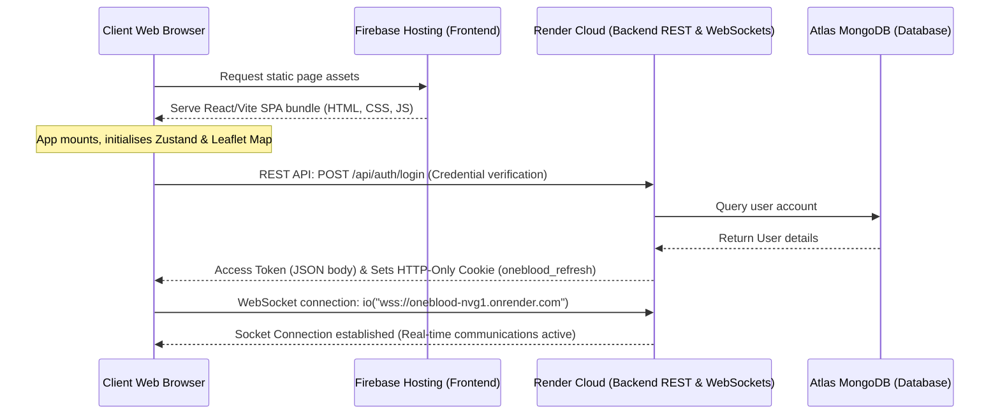
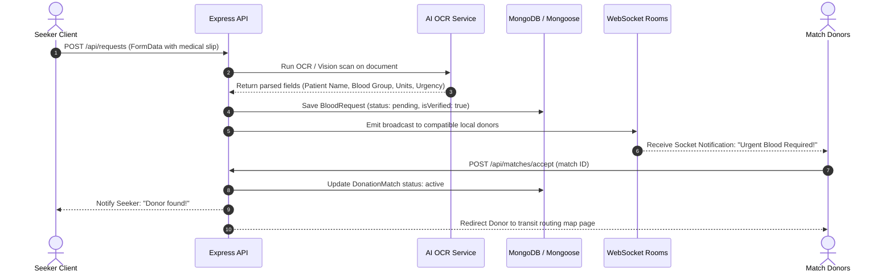

# OneBlood — Complete System Architecture, Codebase & Algorithmic Blueprint

This comprehensive report details the technical implementation, algorithmic logic, execution sequences, and hosting infrastructure of the **OneBlood** real-time emergency blood coordination platform.

---

## 1. 🏢 Deployment & Decoupled Cross-Platform Architecture

The **OneBlood** platform is built on a decoupled, client-server model designed for high availability, low latency, and security.



### 🖥️ Frontend Hosting: Firebase Hosting
- **Platform**: Hosted via Google Firebase Hosting.
- **Characteristics**: Fast content delivery network (CDN), SSL configuration out of the box, and cache management rules defined in [firebase.json](file:///c:/Users/JOEL%20BIJU/Documents/OneBlood/firebase.json).
- **Security Headers**: Custom Content Security Policy (CSP), `X-Content-Type-Options: nosniff`, `X-Frame-Options: DENY`, `Referrer-Policy`, and `Permissions-Policy` headers are strictly enforced at the CDN edge.
- **Client-Side Routing**: SPA architecture redirects all traffic to `index.html` to let `react-router-dom` control URL states.

### ⚙️ Backend Hosting: Render
- **Platform**: Hosted as a Web Service on Render (`https://oneblood-nvg1.onrender.com`).
- **Characteristics**: Connected to the `master` git branch for automatic rebuilds. Runs node entrypoint `backend/src/server.js` with auto-scaling options.
- **HTTPS Redirect**: All incoming HTTP traffic in production is redirected to HTTPS via a 301 redirect.
- **WebSocket Gateway**: Exposes port `10000` to support persistent TCP sockets.

### 🔒 Secure Cross-Platform Interoperability (CORS & Tokens)
Since the frontend and backend are hosted on separate domains, secure cross-origin communication is managed through several mechanisms:
1. **Cross-Origin Resource Sharing (CORS)**:
   The backend Express app (`backend/src/app.js`) configures CORS using strict whitelisting:
   ```javascript
   const allowedOrigins = [
     'https://oneblood-app.web.app',
     'https://oneblood-app.firebaseapp.com',
     'http://localhost:5173'
   ];
   app.use(cors({
     origin: (origin, callback) => {
       if (!origin || allowedOrigins.includes(origin)) {
         callback(null, true);
       } else {
         callback(new Error('Blocked by CORS policy'));
       }
     },
     credentials: true
   }));
   ```
2. **Access Token & Refresh Token Flow (HTTP-Only Cookie Rotation)**:
   - **Access Token**: Short-lived JWT access tokens (15-minute expiry) are saved solely in-memory within React state via [authStore.js](file:///c:/Users/JOEL%20BIJU/Documents/OneBlood/frontend/src/store/authStore.js) to eliminate local storage XSS theft vulnerabilities.
   - **Refresh Token**: Long-lived refresh tokens are stored exclusively inside secure, HTTP-only cookies (`oneblood_refresh`) with `sameSite: 'none'` (for production cross-domain security) and `secure: true`.
   - **Silent Refresh**: Axios interceptors configured in [api.js](file:///c:/Users/JOEL%20BIJU/Documents/OneBlood/frontend/src/utils/api.js) automatically request a fresh access token from the backend `/api/auth/refresh` endpoint on receiving a `401 Unauthorized` response. The browser attaches the cookie automatically due to the `withCredentials: true` configuration.
3. **WebSocket Handshake Auth**:
   Sockets are initialized with authorization headers passing the token directly. The backend validates this token and verifies user identity against the database before joining the client to any socket channels.

---

## 2. 📂 Project Folder Directory Structure Walkthrough

Below is a detailed guide to every core folder in the monorepo workspace:

### 🖥️ Frontend Structure (`/frontend`)
- **`src/main.jsx`**: Bootstraps the React client application and binds it to the root DOM node.
- **`src/App.jsx`**: Mounts client-side routing structures (defining paths for Seekers, Donors, Banks, Map search, Chat, Admin dashboard).
- **`src/pages/`**:
  - `LandingPage.jsx`: Dynamic visual landing with Framer Motion scroll indicators and calls to action.
  - `LoginPage.jsx` / `SignupPage.jsx` / `OTPVerifyPage.jsx`: Renders authentication portals and inputs.
  - `DonorHomePage.jsx` & `SeekerHomePage.jsx`: Displays active requests, donor eligibility warnings (such as the 56-day donation lock), matching statistics, and navigation tools.
  - `SearchPage.jsx`: Provides the Leaflet coordinate-based seeker map tool to search nearby resources.
  - `NewRequestPage.jsx`: The blood request requisition form with AI file upload.
  - `ActiveDonationsPage.jsx`: Keeps track of donor and seeker active matches, current stages, and PDF download keys.
- **`src/store/`**:
  - `authStore.js`: Global Zustand state managing current login profile details, token storage, and active role-toggles.
  - `notificationStore.jsx`: React Context hooks subscribing to real-time notification feeds.
- **`src/utils/`**:
  - `api.js`: Preconfigured HTTP client utilizing interceptors for session refreshing.
  - `sanitize.js`: DOMPurify wrapper that sanitizes raw HTML elements to mitigate Cross-Site Scripting (XSS).

### ⚙️ Backend Structure (`/backend`)
- **`src/server.js`**: Starts the HTTP listener, configures port routing, and binds the socket.io listener.
- **`src/app.js`**: Sets up HTTP middlewares (such as security headers, express-rate-limit 4-tier limits, Helmet CSP, Permissions-Policy, and body limiters).
- **`src/config/`**:
  - `db.js`: Mongoose connector managing MongoDB connection pools.
  - `firebase.js`: Firebase Admin application initialiser.
  - `redis.js`: Caching connector falling back to standard RAM memory variables if Redis server is offline.
- **`src/middleware/`**:
  - `auth.js`: Implements jwt authorization checks, including `optionalAuth` for selective data redaction.
  - `validate.js`: Implements input validation rules for all routes via `express-validator`.
  - `upload.js`: Wraps Multer, restricts file uploads to a 10MB limit, whitelist-filters allowed file MIME types (JPEG, PNG, WEBP, PDF), and handles errors securely.
  - `errorHandler.js`: Production-safe global error handler that redacts stack traces and maps specific db validation/JWT/Multer exceptions to custom HTTP responses.
- **`src/models/`**: Defines schemas for `User.js`, `Donor.js`, `BloodBank.js`, `Hospital.js`, `BloodRequest.js`, `DonationMatch.js`, `Message.js`, and `NoticeBoard.js`.
- **`src/controllers/`**:
  - `authController.js`: Registration, login, session validation, JWT token rotation, password resets, and account lockout handling.
  - `matchController.js`: Handlers managing donor acceptances, transit detours, state transitions, and secure PDF document streaming.
  - `hospitalController.js`: Direct hospital API handlers.
- **`src/services/`**:
  - `pdfService.js`: Renders professional match slips using `pdfkit`.
  - `aiVerification.js`: Extracts clinical requisition metadata from document uploads.
  - `escalationService.js`: Escalation triggers alert distributions dynamically to verified hospital admins.
  - `socketService.js`: Controls socket channel logic.

---

## 3. 🧠 Core Algorithms & Technical Logic

The platform relies on several key algorithms to verify credentials, locate nearby matching resources, and generate secure match verification documentation.

### 📍 1. Geospatial Proximity Matcher (MongoDB 2dsphere Indexing)
To identify nearby donors, donor locations are indexed in MongoDB using a GeoJSON `2dsphere` coordinate index. This allows the backend to perform native spherical queries to find donors within a specified radius.

**MongoDB Schema Configuration**:
```javascript
// Location field defined inside Donor.js
location: {
  type: { type: String, default: 'Point' },
  coordinates: { type: [Number], required: true } // [longitude, latitude]
}
donorSchema.index({ location: '2dsphere' });
```

**Geospatial Query API**:
```javascript
// Extract longitude and latitude of seeker
const { lng, lat, radiusInKms } = req.query;

const nearbyDonors = await Donor.find({
  location: {
    $nearSphere: {
      $geometry: {
        type: "Point",
        coordinates: [parseFloat(lng), parseFloat(lat)]
      },
      $maxDistance: parseFloat(radiusInKms) * 1000 // Convert KMs to Meters
    }
  },
  status: 'available'
}).populate('userId');
```

---

### 🩸 2. Blood Group Compatibility Matrix
When blood requests are published or matched, compatibility rules dictate matching options. This matrix is implemented as a programmatic dictionary matching recipient groups to compatible donor groups.

```javascript
/**
 * Resolves compatible donor groups for a given recipient group.
 * Follows clinical rules for whole-blood and red-cell compatibility.
 */
const getCompatibleDonorGroups = (recipientGroup) => {
  const compatibilityMap = {
    'O-':  ['O-'],
    'O+':  ['O-', 'O+'],
    'A-':  ['O-', 'A-'],
    'A+':  ['O-', 'O+', 'A-', 'A+'],
    'B-':  ['O-', 'B-'],
    'B+':  ['O-', 'O+', 'B-', 'B+'],
    'AB-': ['O-', 'A-', 'B-', 'AB-'],
    'AB+': ['O-', 'O+', 'A-', 'A+', 'B-', 'B+', 'AB-', 'AB+'] // Universal Recipient
  };
  return compatibilityMap[recipientGroup] || [];
};
```

---

### 📄 3. Dual AI-OCR Verification Pipeline
When a seeker uploads a doctor's letter, the platform passes it to a dual-engine verification pipeline:
1. **Primary (Anthropic Claude 3.5 Sonnet Vision)**: Sends the document image to Claude to parse the doctor's handwriting/letterhead, confirm its validity, extract patient name, required units, blood group, and set an urgency level.
2. **Secondary (Local Tesseract.js / pdf-parse fallback)**: If the API fails or limits are reached, a local fallback performs OCR on the document, running regex string matching for blood groups and medical validation terms.

```javascript
// Extracts key blood groups using regex
const detectBloodGroup = (text) => {
  const match = text.match(/\b(A|B|AB|O)[\s]?[+-](?:\b|Group)/gi);
  return match ? match[0].toUpperCase().replace(/\s+/g, '') : null;
};
```

---

### 🚨 4. Dynamic Escalation Alert Engine
If a critical request is published on the Notice Board but receives no donor responses within a specified time limit, the **Escalation Engine** triggers escalation workflows:
- **First 30 minutes**: Sends push alerts to matching local donors in a 5KM radius.
- **After 1 hour**: Broadcasts alert emails and expands the search radius to 15KM.
- **After 2 hours**: Generates detour bank proposals suggesting redirecting the donor to a transit blood bank holding compatible stock.
- **Email Verification Gate**: The escalation engine verifies if a hospital's email has been verified (`hospital.emailVerified === true`) before dispatching critical alerts, preventing silent alert delivery failures.

---

### 🔒 5. Hardened Authentication & Access Control Algorithms
- **Account Enumeration Mitigation**: All authentication endpoints return a generic `"Invalid credentials."` message, irrespective of whether the email is missing or the password hash comparison failed.
- **Per-Account Bruteforce Lockout**: The system counts failed logins (`failedLoginAttempts`). If attempts exceed 10, the account is locked (`lockoutUntil` is set to 30 minutes in the future) and a warning email is automatically dispatched.
- **OneBlood ID Circuit Breaker**: The automatic unique ID generator is capped at a maximum of 10 retry loop cycles to prevent theoretical infinite collision loops.
- **Secure PDF Streamer**: Direct static exposure of match PDFs is disabled. Accessing PDF coordination slips requires calling `GET /api/match/:matchedObId/document`. The handler fetches the `DonationMatch` document and checks if `req.userId` matches the `seekerId`, `donorId`, or the `userId` on the referenced `Hospital` profile. Only authorized users are streamed the file from disk via `res.sendFile()`.

---

## 4. 🔄 End-to-End Operational Sequences

The entire matching workflow involves dynamic HTTP API endpoints, database state changes, and live WebSocket broadcasts.

### Sequence: Emergency Request Creation to Full Verification



---

## 5. 🗄️ Database Schemas Catalog (MongoDB / Mongoose)

Below are the key structured data models implemented on the platform:

### 👤 1. `User` Schema
Tracks identities, core settings, login limits, and reset token parameters.
```javascript
const userSchema = new mongoose.Schema({
  onebloodId: { type: String, unique: true, required: true },
  name: { type: String, required: true },
  email: { type: String, unique: true, required: true },
  phone: { type: String, required: true },
  passwordHash: { type: String, required: true },
  role: { type: String, enum: ['donor', 'seeker', 'hospital', 'blood_bank', 'admin'], default: 'seeker' },
  city: { type: String, required: true },
  refreshTokenHash: { type: String },
  failedLoginAttempts: { type: Number, default: 0 },
  lockoutUntil: { type: Date },
  resetTokenHash: { type: String },
  resetTokenExpiry: { type: Date }
}, { timestamps: true });
```

### 🏥 2. `Hospital` Schema
Enforces identity tracking, geolocation, and email validation status.
```javascript
const hospitalSchema = new mongoose.Schema({
  userId: { type: mongoose.Schema.Types.ObjectId, ref: 'User', required: true },
  hospitalName: { type: String, required: true },
  registrationNumber: { type: String, required: true },
  hospitalType: { type: String, required: true },
  address: { type: String, required: true },
  city: { type: String, required: true },
  state: { type: String, required: true },
  pincode: { type: String, required: true },
  emergencyContact: { type: String, required: true },
  emailVerified: { type: Boolean, default: false },
  emailVerificationToken: { type: String },
  verificationStatus: { type: String, enum: ['pending', 'approved', 'rejected'], default: 'pending' },
  location: {
    type: { type: String, default: 'Point' },
    coordinates: { type: [Number], required: true } // [longitude, latitude]
  }
}, { timestamps: true });
```

### 🩸 3. `Donor` Schema
Stores donor-specific medical information and geolocation coordinates.
```javascript
const donorSchema = new mongoose.Schema({
  userId: { type: mongoose.Schema.Types.ObjectId, ref: 'User', required: true },
  bloodGroup: { type: String, required: true },
  status: { type: String, enum: ['available', 'unavailable', 'suspended'], default: 'available' },
  lastDonated: { type: Date },
  totalDonations: { type: Number, default: 0 },
  age: { type: Number },
  weight: { type: Number },
  city: { type: String, required: true },
  location: {
    type: { type: String, default: 'Point' },
    coordinates: { type: [Number], required: true }
  }
});
donorSchema.index({ location: '2dsphere' });
```

### 🤝 4. `DonationMatch` Schema
Stores and manages active match state transitions, evidence certificates, and protected slips.
```javascript
const donationMatchSchema = new mongoose.Schema({
  matchObid: { type: String, required: true, unique: true },
  seekerId: { type: mongoose.Schema.Types.ObjectId, ref: 'User', required: true },
  donorId: { type: mongoose.Schema.Types.ObjectId, ref: 'User', required: true },
  destinationType: { type: String, enum: ['Hospital', 'BloodBank', 'BloodBankAndHospital'], default: 'Hospital' },
  hospitalId: { type: mongoose.Schema.Types.ObjectId, ref: 'Hospital', required: true },
  bloodBankId: { type: mongoose.Schema.Types.ObjectId, ref: 'BloodBank' },
  requestId: { type: mongoose.Schema.Types.ObjectId, required: true },
  requestType: { type: String, enum: ['BloodRequest', 'NoticeBoard'], default: 'BloodRequest' },
  bloodGroup: { type: String, required: true },
  units: { type: Number, required: true },
  status: { type: String, enum: ['in_progress', 'completed', 'cancelled'], default: 'in_progress' },
  stage: { type: String, enum: ['at_blood_bank', 'at_hospital', 'completed', 'cancelled'], default: 'at_hospital' },
  pdfPath: { type: String }
}, { timestamps: true });
```

---

## 6. 🏁 Summary of Platform Readiness

The **OneBlood** system is optimized and ready for production deployment:

1. **Frontend**: The React application builds into a optimized production bundle (`frontend/dist/`), hosted securely under global CDNs on Firebase Hosting with hardened CSP headers.
2. **Backend**: Express APIs and WebSocket coordinators run on Render, secured with rate limiters, strict CORS, and redirecting HTTP requests to HTTPS.
3. **Identity Security**: Features per-account lockout, password reset flows, secure cookie-based JWT sessions, and hospital email verification.
4. **Data Redaction**: Masking rules are applied to keep sensitive fields (e.g., hospital details) hidden from unauthenticated notice board visitors.
5. **Secure PDF Generator**: Access to match documents is gated by role-based ownership, restricting static downloads to authorized coordination parties.
