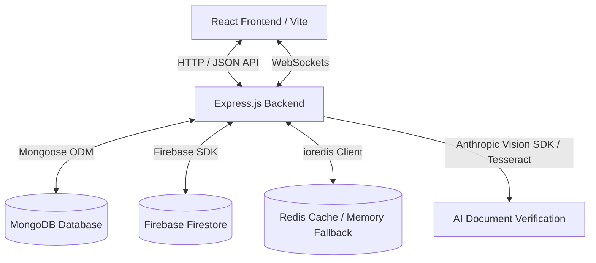

# OneBlood - Complete Project Architecture and Feature Summary

This document provides a detailed breakdown of the **OneBlood** platform—a real-time, AI-powered emergency blood coordination website. It covers the technical architecture, directory structure, system features, and database schemas.

---

## 🏢 Project Architecture

OneBlood is structured as a decoupled monorepos/polyrepos system with:
1. **Frontend (Client)**: A modern, single-page application built on React and Vite, styled using Tailwind CSS and dynamic custom animations (Framer Motion).
2. **Backend (Server)**: A Node.js Express server acting as a REST API and a real-time event coordinator via Socket.IO.
3. **Databases**: A hybrid storage system leveraging **MongoDB** (via Mongoose) as the primary database store, **Firebase Firestore** as an indexing or auxiliary data layer, and **Redis** (with in-memory fallback) for high-performance session caching.



---

## 📁 Repository Directory Structure

### 🖥️ Frontend (`/frontend`)
- **`src/main.jsx` & `src/App.jsx`**: Application entry points and client-side routing.
- **`src/pages/`**: Contains the main page components of the application:
  - `LandingPage.jsx`, `AboutPage.jsx`, `HowItWorksPage.jsx`: Informational static/semi-dynamic pages.
  - `LoginPage.jsx`, `SignupPage.jsx`, `OTPVerifyPage.jsx`: Authentication flow pages.
  - `DonorHomePage.jsx` & `SeekerHomePage.jsx`: Custom home feeds tailored to user roles.
  - `DonorRegistrationPage.jsx` & `BankSetupPage.jsx`: Detailed onboarding forms for special roles.
  - `SearchPage.jsx`: Map-based search interface using Leaflet maps to look up donors and banks.
  - `NewRequestPage.jsx`: Smart requisition form featuring AI document upload.
  - `AdminPanel.jsx` & `AdminMonitoringPage.jsx`: Visual management interfaces for administrators.
- **`src/components/`**: Reusable elements such as navigation layout, form helpers, and maps.
- **`src/store/`**: Global state management powered by **Zustand** (specifically `authStore.js`).
- **`src/utils/api.js`**: Axios wrapper pre-configured with interceptors to automatically refresh access tokens.

### ⚙️ Backend (`/backend`)
- **`src/server.js`**: Server entrypoint establishing HTTP listening and wrapping Socket.IO with JWT authorization.
- **`src/app.js`**: Express app bootstrapper containing security middlewares (Helmet, CORS, MongoSanitize, and rate limiters).
- **`src/config/`**:
  - `db.js`: MongoDB Mongoose configuration.
  - `firebase.js`: Firebase Admin SDK credentials loader.
  - `redis.js`: Wrapper utility falling back to in-memory store if Redis server isn't reachable.
- **`src/models/`**: Mongoose models defining database schemas.
- **`src/controllers/`**: Logic controllers mapping endpoints to service workflows.
- **`src/routes/`**: Route routers specifying REST endpoints.
- **`src/services/`**:
  - `aiVerification.js`: Core AI analyzer using Anthropic's Claude 3.5 Sonnet Vision or local Tesseract OCR & PDF parsers to extract blood groups, requisition units, hospital names, and verify documents.
  - `emailService.js`: Email dispatch system utilizing NodeMailer and Resend.
  - `notificationService.js`: Unified dispatch helper linking DB records, WebSocket emits, and emails.
  - `socketService.js`: Real-time room manager.

---

## 🌟 Core Platform Features

### 🔑 1. Authentication & Role Management
- **Identities**: Users register under 4 major roles: `donor`, `patient` (seeker), `blood_bank`, or `admin`.
- **OneBlood ID**: Every user receives a unique system ID. Login supports both **OneBlood ID** or email.
- **Role Switching**: Users can toggle between roles dynamically (e.g., a donor can switch to seeker mode to request blood).
- **Token Security**: Employs short-lived JWT access tokens stored in-memory, paired with long-lived refresh tokens stored securely in `localStorage` and verified via a `/auth/refresh` endpoint.

### 🗺️ 2. Geographic Leaflet Map Search & Router
- **Interactive Map**: Renders donors and blood banks as coordinates on a dark-themed Leaflet Map wrapper.
- **Geocoding & Directions**: Uses a backend router `/api/directions` to fetch routing instructions and distance matrices, letting patients see exact distances to donors.

### 📄 3. AI-Powered Medical Document Verification
- **Requisition OCR**: When creating a request, users upload a doctor's letter or requisition slip.
- **Dual Verification Engines**:
  - **Primary**: Claude 3.5 Sonnet checks for letterheads, doctor signatures, and urgency signs. It outputs structured JSON.
  - **Fallback**: Local OCR pipeline using `Tesseract.js` and `pdf-parse` extracts raw text and executes regex keyword matching.
- **Urgency Levels**: Automatically extracts and classifies urgency: `critical` (immediate action), `urgent` (within 24 hrs), `moderate`, or `planned`.

### 💬 4. Notice Board & Live Chat Rooms
- **Notice Board**: A public request board where patients display verified requests. Other users can click to respond.
- **Dynamic WebSockets**: When a donor responds to a request, they join a private WebSocket-backed room (`chat_[requestId]`). This allows real-time instant messaging without disclosing personal numbers until permission is granted.

### 🔔 5. Multi-Channel Notifications
- **Web App Pulls**: Database-backed notification records listed on the `NotificationsPage`.
- **Real-Time Push**: Instant web socket emissions (`socket.emit('notification', ...)`).
- **Email Alerts**: Fallback email notifications for critical status changes and high-priority blood alerts.

---

## 🗄️ Database Schemas (Mongoose)

### 👤 `User`
```javascript
{
  onebloodId: { type: String, unique: true },
  name: { type: String, required: true },
  email: { type: String, unique: true, required: true },
  phone: { type: String, required: true },
  password: { type: String, required: true },
  role: { type: String, enum: ['donor', 'patient', 'blood_bank', 'admin'], default: 'patient' },
  city: { type: String, required: true },
  refreshToken: { type: String },
  isEmailVerified: { type: Boolean, default: false }
}
```

### 🩸 `Donor`
```javascript
{
  userId: { type: mongoose.Schema.Types.ObjectId, ref: 'User', required: true },
  bloodGroup: { type: String, required: true },
  status: { type: String, enum: ['available', 'unavailable', 'suspended'], default: 'available' },
  lastDonationDate: { type: Date },
  city: { type: String, required: true },
  location: {
    type: { type: String, default: 'Point' },
    coordinates: [Number] // [longitude, latitude]
  }
}
```

### 🏥 `BloodBank`
```javascript
{
  userId: { type: mongoose.Schema.Types.ObjectId, ref: 'User', required: true },
  name: { type: String, required: true },
  inventory: [{
    bloodGroup: { type: String },
    units: { type: Number, default: 0 }
  }],
  address: { type: String, required: true },
  verified: { type: Boolean, default: false }
}
```

### 📝 `BloodRequest`
```javascript
{
  requesterId: { type: mongoose.Schema.Types.ObjectId, ref: 'User', required: true },
  bloodGroup: { type: String, required: true },
  unitsRequired: { type: Number, default: 1 },
  hospitalName: { type: String, required: true },
  doctorName: { type: String },
  urgency: { type: String, enum: ['critical', 'urgent', 'moderate', 'planned'], default: 'moderate' },
  documentUrl: { type: String }, // Path to uploaded medical doc
  isVerified: { type: Boolean, default: false },
  status: { type: String, enum: ['pending', 'active', 'fulfilled', 'cancelled'], default: 'pending' },
  responses: [{
    responderId: { type: mongoose.Schema.Types.ObjectId, ref: 'Donor' },
    status: { type: String, enum: ['pending', 'accepted', 'rejected', 'completed'], default: 'pending' },
    respondedAt: { type: Date, default: Date.now }
  }]
}
```

### 💬 `Message`
```javascript
{
  requestId: { type: mongoose.Schema.Types.ObjectId, ref: 'BloodRequest', required: true },
  senderId: { type: mongoose.Schema.Types.ObjectId, ref: 'User', required: true },
  receiverId: { type: mongoose.Schema.Types.ObjectId, ref: 'User', required: true },
  text: { type: String, required: true },
  createdAt: { type: Date, default: Date.now },
  readAt: { type: Date }
}
```
