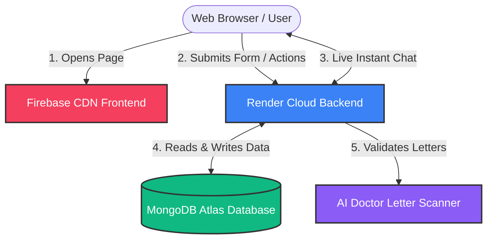
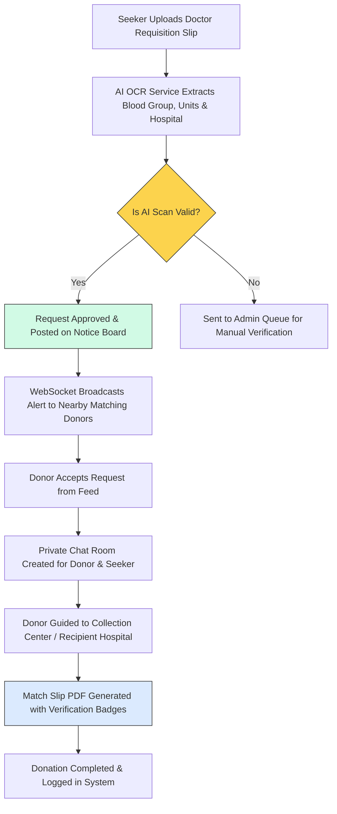
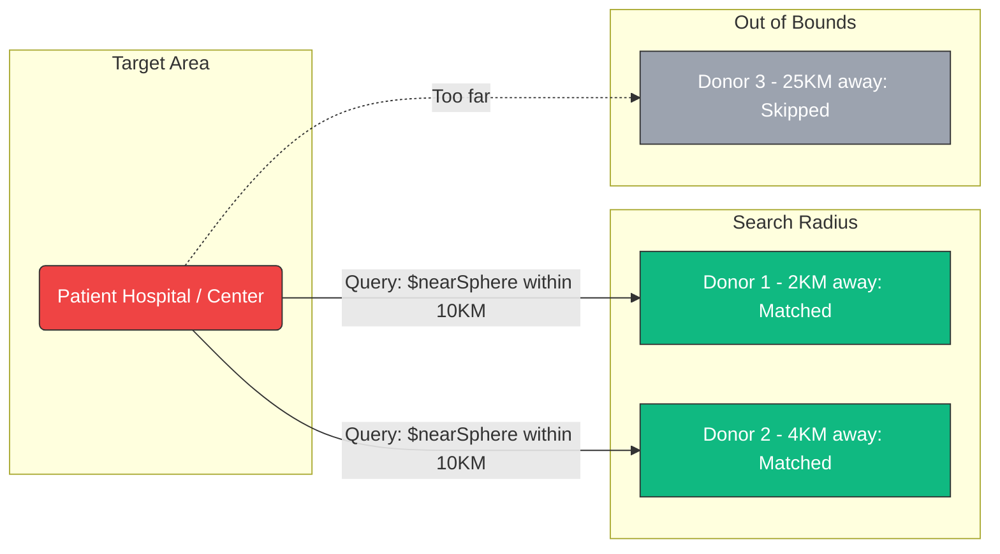

# OneBlood — Visual Companion & Simplified System Guide

This guide provides a highly visual, easy-to-understand breakdown of the **OneBlood** platform's architecture, data flows, and matching logic.

---

## 🗺️ 1. High-Level Architecture (Where things live & how they talk)

OneBlood separates the frontend (user interface) and backend (server logic) to ensure fast load speeds and reliable operations.

### Quick Summary:
* **Frontend (React)**: Hosted on **Firebase Hosting**. This handles what the user sees, clicks, and interacts with on the map.
* **Backend (Node.js/Express)**: Hosted on **Render**. It handles routing, authorization tokens, database connections, and coordinates real-time chat sockets.
* **Database (MongoDB)**: Stores data on users, donors, banks, and request statuses.
* **AI OCR engine**: Anthropic Vision and Tesseract read doctor letters to prevent fraud.

---

## 🔄 2. Complete Flow: Request Creation to Delivery

Here is the exact lifecycle of a blood request when a seeker creates one.

---

## 🧬 3. The Proximity Matcher (How nearby donors are found)

To find available donors close to a patient, the system indexes donor coordinates using **MongoDB Geospatial indexing**.

---

## 🩸 4. Match Grid (Who can donate to whom?)

Clinical rules are programmed directly into the compatibility engine:

| Recipient Blood Group | Compatible Donor Blood Groups |
|:---------------------:|:------------------------------|
| **O-** | O- (Universal Donor) |
| **O+** | O-, O+ |
| **A-** | O-, A- |
| **A+** | O-, O+, A-, A+ |
| **B-** | O-, B- |
| **B+** | O-, O+, B-, B+ |
| **AB-**| O-, A-, B-, AB- |
| **AB+**| O-, O+, A-, A+, B-, B+, AB-, AB+ (Universal Recipient) |

---

## 💬 5. Chat & Routing Coordination

When a match is approved:
1. **Private Chat**: Standard WebSockets establish a connection using a room identifier `chat_[requestId]`. Users send messages instantly without exposing their private phone numbers on the public web feed.
2. **Transit Routing**: Renders map pins showing the donor's location, the transit blood bank (if holding compatible stocks), and the final recipient hospital to coordinate the transport path.
3. **Official PDF Match Slip**: A clean, digital document generated dynamically without QR codes or clutter. Features verification tick checklist marks and security authorization badges to ensure official hospital recognition.
